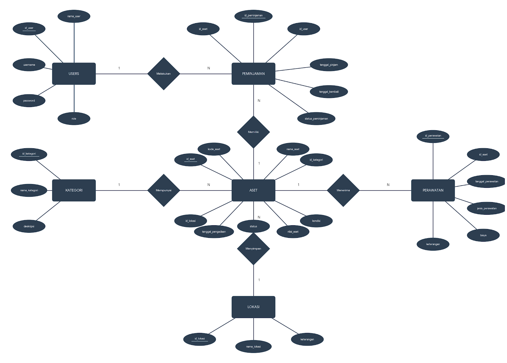

# PROGRES 2 – PERANCANGAN BASIS DATA

## Sistem Manajemen Aset dan Barang Inventaris Kantor

---

# 1. ERD (Entity Relationship Diagram)

## Entitas dan Relasi

## Diagram Erd

---

# 2. Penjelasan Entitas dan Relasi

## 2.1 Entitas USERS

Entitas USERS digunakan untuk menyimpan data pengguna yang dapat mengakses Sistem Manajemen Aset dan Barang Inventaris Kantor. Data yang disimpan meliputi identitas pengguna, username, password, dan hak akses (role).

Atribut:

* id_user (Primary Key)
* nama_user
* username
* password
* role

Relasi:
Entitas USERS memiliki hubungan dengan entitas PEMINJAMAN melalui relasi "Melakukan". Satu pengguna dapat melakukan banyak peminjaman aset, sedangkan satu peminjaman hanya dilakukan oleh satu pengguna.

Kardinalitas:
USERS (1) : (N) PEMINJAMAN

---

## 2.2 Entitas PEMINJAMAN

Entitas PEMINJAMAN digunakan untuk mencatat seluruh transaksi peminjaman aset yang dilakukan oleh pengguna. Data yang disimpan meliputi aset yang dipinjam, pengguna yang meminjam, tanggal peminjaman, tanggal pengembalian, dan status peminjaman.

Atribut:

* id_peminjaman (Primary Key)
* id_aset
* id_user
* tanggal_pinjam
* tanggal_kembali
* status_peminjaman

Relasi:
PEMINJAMAN berhubungan dengan USERS melalui relasi "Melakukan" dan berhubungan dengan ASET melalui relasi "Memiliki". Setiap transaksi peminjaman melibatkan satu aset dan satu pengguna.

Kardinalitas:

* USERS (1) : (N) PEMINJAMAN
* ASET (1) : (N) PEMINJAMAN

---

## 2.3 Entitas KATEGORI

Entitas KATEGORI digunakan untuk mengelompokkan aset berdasarkan jenis atau kelompok tertentu. Pengelompokan ini memudahkan pengelolaan dan pencarian data aset.

Atribut:

* id_kategori (Primary Key)
* nama_kategori
* deskripsi

Relasi:
KATEGORI berhubungan dengan ASET melalui relasi "Mempunyai". Satu kategori dapat memiliki banyak aset, sedangkan satu aset hanya termasuk dalam satu kategori.

Kardinalitas:
KATEGORI (1) : (N) ASET

---

## 2.4 Entitas ASET

Entitas ASET merupakan entitas utama yang menyimpan seluruh informasi mengenai barang inventaris kantor. Data yang disimpan meliputi identitas aset, kategori, lokasi, tanggal pengadaan, nilai aset, kondisi, dan status aset.

Atribut:

* id_aset (Primary Key)
* kode_aset
* nama_aset
* id_kategori
* id_lokasi
* tanggal_pengadaan
* nilai_aset
* kondisi
* status

Relasi:
ASET berhubungan dengan KATEGORI melalui relasi "Mempunyai", dengan PEMINJAMAN melalui relasi "Memiliki", dengan PERAWATAN melalui relasi "Menerima", dan dengan LOKASI melalui relasi "Menyimpan".

Kardinalitas:

* KATEGORI (1) : (N) ASET
* ASET (1) : (N) PEMINJAMAN
* ASET (1) : (N) PERAWATAN
* LOKASI (1) : (N) ASET

---

## 2.5 Entitas PERAWATAN

Entitas PERAWATAN digunakan untuk mencatat seluruh kegiatan perawatan yang dilakukan terhadap aset. Data yang dicatat meliputi tanggal perawatan, jenis perawatan, biaya, dan keterangan tambahan.

Atribut:

* id_perawatan (Primary Key)
* id_aset
* tanggal_perawatan
* jenis_perawatan
* biaya
* keterangan

Relasi:
PERAWATAN berhubungan dengan ASET melalui relasi "Menerima". Satu aset dapat menerima banyak perawatan, sedangkan satu data perawatan hanya berkaitan dengan satu aset.

Kardinalitas:
ASET (1) : (N) PERAWATAN

---

## 2.6 Entitas LOKASI

Entitas LOKASI digunakan untuk menyimpan informasi mengenai tempat atau lokasi penyimpanan aset di dalam kantor.

Atribut:

* id_lokasi (Primary Key)
* nama_lokasi
* keterangan

Relasi:
LOKASI berhubungan dengan ASET melalui relasi "Menyimpan". Satu lokasi dapat menyimpan banyak aset, sedangkan satu aset hanya berada pada satu lokasi.

Kardinalitas:
LOKASI (1) : (N) ASET

---

# 3. Kamus Data (Data Dictionary)

## Tabel Users

| Field     | Tipe Data    | Keterangan     |
| --------- | ------------ | -------------- |
| id_user   | INT          | Primary Key    |
| nama_user | VARCHAR(100) | Nama pengguna  |
| username  | VARCHAR(50)  | Username login |
| password  | VARCHAR(255) | Password       |
| role      | VARCHAR(20)  | Hak akses      |

---

## Tabel Kategori

| Field         | Tipe Data    | Keterangan         |
| ------------- | ------------ | ------------------ |
| id_kategori   | INT          | Primary Key        |
| nama_kategori | VARCHAR(100) | Nama kategori      |
| deskripsi     | TEXT         | Deskripsi kategori |

---

## Tabel Lokasi

| Field       | Tipe Data    | Keterangan        |
| ----------- | ------------ | ----------------- |
| id_lokasi   | INT          | Primary Key       |
| nama_lokasi | VARCHAR(100) | Nama lokasi       |
| keterangan  | TEXT         | Keterangan lokasi |

---

## Tabel Aset

| Field             | Tipe Data     | Keterangan        |
| ----------------- | ------------- | ----------------- |
| id_aset           | INT           | Primary Key       |
| kode_aset         | VARCHAR(20)   | Kode aset         |
| nama_aset         | VARCHAR(100)  | Nama aset         |
| id_kategori       | INT           | Foreign Key       |
| id_lokasi         | INT           | Foreign Key       |
| tanggal_pengadaan | DATE          | Tanggal pengadaan |
| nilai_aset        | DECIMAL(15,2) | Nilai aset        |
| kondisi           | VARCHAR(30)   | Kondisi aset      |
| status            | VARCHAR(30)   | Status aset       |

---

## Tabel Peminjaman

| Field             | Tipe Data   | Keterangan       |
| ----------------- | ----------- | ---------------- |
| id_peminjaman     | INT         | Primary Key      |
| id_aset           | INT         | Foreign Key      |
| id_user           | INT         | Foreign Key      |
| tanggal_pinjam    | DATE        | Tanggal pinjam   |
| tanggal_kembali   | DATE        | Tanggal kembali  |
| status_peminjaman | VARCHAR(20) | Status transaksi |

---

## Tabel Perawatan

| Field             | Tipe Data     | Keterangan        |
| ----------------- | ------------- | ----------------- |
| id_perawatan      | INT           | Primary Key       |
| id_aset           | INT           | Foreign Key       |
| tanggal_perawatan | DATE          | Tanggal perawatan |
| jenis_perawatan   | VARCHAR(100)  | Jenis perawatan   |
| biaya             | DECIMAL(15,2) | Biaya             |
| keterangan        | TEXT          | Catatan           |

---

# 4. Normalisasi

Normalisasi merupakan proses pengelompokan data ke dalam beberapa tabel agar data tidak berulang (redundansi), lebih terorganisir, serta mudah dikelola, dan di sistem ini normalisasi dilakukan hingga Bentuk Normal Ketiga (3NF).

## 4.1 Unnormalized Form (UNF)

Tahap awal, seluruh data aset, pengguna, peminjaman, dan perawatan masih berada dalam satu tabel besar.

Contoh:

| id_aset | nama_aset     | kategori   | lokasi   | nama_user | tanggal_pinjam | jenis_perawatan  | biaya  |
| ------- | ------------- | ---------- | -------- | --------- | -------------- | ---------------- | ------ |
| A001    | Laptop Lenovo | Elektronik | Ruang IT | Budi      | 01-06-2026     | Service Keyboard | 150000 |

Bentuk ini masih terdapat pengulangan data dan seluruh informasi tersimpan dalam satu tabel.

---

## 4.2 First Normal Form (1NF)

Ditahap ini setiap data harus memiliki nilai yang tunggal dan tidak boleh terdapat kelompok data yang berulang.

Data mulai dipisahkan berdasarkan jenis informasinya, misalnya data pengguna, data aset, data peminjaman, dan data perawatan.

### USERS

* id_user
* nama_user
* username
* password
* role

### ASET

* id_aset
* nama_aset
* kategori
* lokasi

### PEMINJAMAN

* id_peminjaman
* id_user
* tanggal_pinjam

### PERAWATAN

* id_perawatan
* jenis_perawatan
* biaya

Dengan pemisahan ini, data menjadi lebih terstruktur dibandingkan sebelumnya.

---

## 4.3 Second Normal Form (2NF)

Lalu di tahap ini setiap atribut harus bergantung sepenuhnya pada Primary Key masing-masing tabel.

Data kemudian dipisahkan lebih lanjut agar tidak terjadi ketergantungan parsial. Informasi kategori dan lokasi yang sebelumnya berada pada tabel aset dipisahkan menjadi tabel tersendiri.

Struktur tabel menjadi:

### USERS

* id_user
* nama_user
* username
* password
* role

### KATEGORI

* id_kategori
* nama_kategori
* deskripsi

### LOKASI

* id_lokasi
* nama_lokasi
* keterangan

### ASET

* id_aset
* nama_aset
* id_kategori
* id_lokasi

### PEMINJAMAN

* id_peminjaman
* id_user
* id_aset
* tanggal_pinjam

### PERAWATAN

* id_perawatan
* id_aset
* jenis_perawatan
* biaya

Dengan pemisahan ini, setiap data hanya bergantung pada Primary Key tabel masing-masing.

---

## 4.4 Third Normal Form (3NF)

Terakhir di tahap ini tidak boleh terdapat ketergantungan transitif antar atribut non-key.

Struktur database akhir yang digunakan dalam sistem adalah:

### USERS

* id_user (PK)
* nama_user
* username
* password
* role

### KATEGORI

* id_kategori (PK)
* nama_kategori
* deskripsi

### LOKASI

* id_lokasi (PK)
* nama_lokasi
* keterangan

### ASET

* id_aset (PK)
* kode_aset
* nama_aset
* id_kategori (FK)
* id_lokasi (FK)
* tanggal_pengadaan
* nilai_aset
* kondisi
* status

### PEMINJAMAN

* id_peminjaman (PK)
* id_aset (FK)
* id_user (FK)
* tanggal_pinjam
* tanggal_kembali
* status_peminjaman

### PERAWATAN

* id_perawatan (PK)
* id_aset (FK)
* tanggal_perawatan
* jenis_perawatan
* biaya
* keterangan

Dengan struktur tersebut, database telah memenuhi Bentuk Normal Ketiga (3NF) karena setiap atribut bergantung langsung pada Primary Key dan tidak terdapat redundansi data yang tidak diperlukan.

---

# 5. Revisi Analisis Kebutuhan

Untuk saat ini belum ada revisi terhadap Progres 1 karena seluruh kebutuhan fungsional, kebutuhan data, dan diagram proses telah sesuai dengan rancangan basis data.
